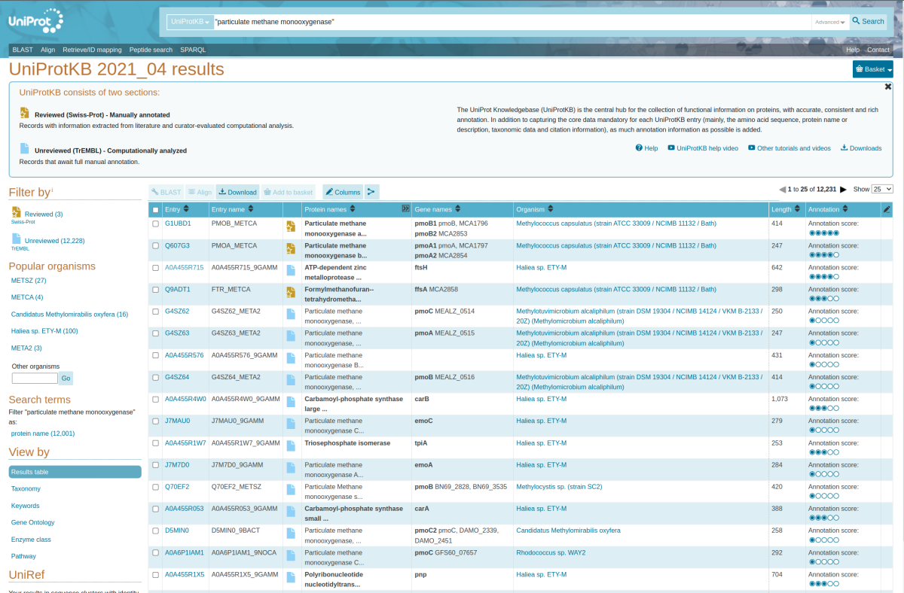
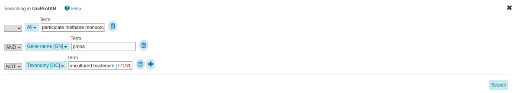
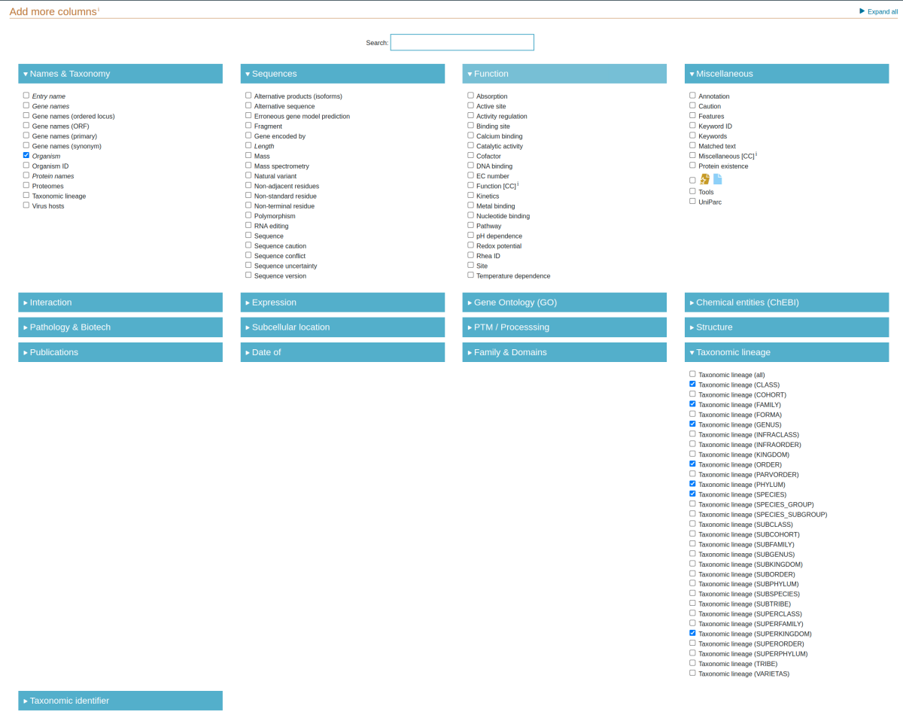

# Acquiring reference sequence data

## Introduction and goals

Reference data in the context of biological sequence analysis are those that come from well-curated open-source databases. These data have been used to create all TreeSAPP reference packages to date, and they should be used to create all future reference packages. But what does "well-curated" mean, and how can you identify data that would meet this standard?

The goals of this tutorial are:

1) Develop a sense of biological sequence database curation quality
1) Learn how to subset and download sequences from the EggNOG and UniProt databases

## The golden standard

The field of genomics is blessed with an abundance of reference data. In fact, it is not uncommon for biologists and bioinformaticians alike to gripe over the increased run-time of computational analyses caused by steps that include comparisons to such large reference databases. Not all of these data are, however, of the same quality. The vast majority have been automatically curated using algorithms with known shortcomings, and only a small portion have been manually curated with verified functional characterization. These latter data are the ones we consider well-curated or golden. More details on choosing databases for retrieving sequences can be found on the [TreeSAPP wiki](https://github.com/hallamlab/TreeSAPP/wiki/Building-reference-packages-with-TreeSAPP#step-1-reference-sequences).

## Recommended biological sequence databases

One of the most comprehensive and reputable biological sequence databases is SwissProt. The protein sequences curated within SwissProt can be accessed and downloaded through the [UniProt Knowledgebase](https://www.uniprot.org/) by selecting "Swiss-Prot" under the "UniProtKB" panel on the left of the landing page. You can submit queries for a protein family through their search bar and add filters to the query using their [advanced search](https://www.uniprot.org/help/advanced_search) options. For example, you can search for reviewed RuBisCO sequences by entering the query 'rubisco taxonomy:"Bacteria [2]" AND reviewed:yes'.

[EggNOG](http://eggnog5.embl.de/#/app/home) is another source of curated orthologous groups. The breadth of families available here is astounding and more often than not they do have the sequences you're looking for. There are a couple of benefits to accessing data from EggNOG. The first is they use a common identifier format. Using the correct identifier for a protein family, a single search will yield all available amino acid sequences belonging to that protein family or COG. What I've found handy is first looking for the Clusters of Orthologous Gene (COG) identifier on NCBI's [Conserved Domains](https://www.ncbi.nlm.nih.gov/Structure/cdd/cdd.shtml) database. Then I'd use that identifier to search for the sequences I'm interested in on EggNOG. The second benefit is the quality of their automated annotation pipeline. With every version of EggNOG, the entire set of protein sequences is clustered and the orthologous groups are defined *de novo*. This prevents incorrect legacy annotations from propagating to new sequences. Unfortunately, the breadth of taxa covered by EggNOG is limited to *just* 5,090 organisms. In many cases, this is good enough to build a "seed" reference package, especially if you're building a reference package of a well-conserved---or housekeeping---gene. Yet, there are plenty of scenarios where the number of sequences downloaded is just too few for your objective, and a more comprehensive reference package is required---more on that below.

In addition to these general and all-encompassing databases, there are smaller curated databases that are independently maintained. These tend to be gene- or function-specific and, as long as they're still maintained, highly reliable. Perhaps the most notable of these is the [Carbohydrate Active enZYmes (CAZy)](http://www.cazy.org/) database. The maintainers of CAZy constantly screen new sequenced from GenBank and sort any hits into different families based on their putative biochemical characterization. [FunGene](http://fungene.cme.msu.edu/) has also been used extensively to build reference packages but due to system instability and variability in curation quality this database is used less often. Still, the focus on biogeochemical cycles and convenient organization, export process, and sequence header format make this database a good back-up.

## XmoA example

To show you how to access these data, we will download the alpha subunit sequences of the enzymes particulate methane monooxygenase (PmoA) and ammonia monooxygenase (AmoA) that are used in the [`treesapp create` tutorial](#treesapp-create) from the EggNOG and UniProt databases. Since XmoA is not a recognized identifier, but a convenient label that reflects the operon structure (_xmoCAB_) of homologous oxidoreductase enzymes, we will need to search in databases multiple times.

### EggNOG

Go to the EggNOG website at http://eggnog5.embl.de/#/app/home and search for either "ENOG5028JPK" or "arCOG08676" in the search bar at the top of the page. These EggNOG ortholog identifiers correspond to PmoA/AmoA from Bacteria and AmoA from Archaea, respectively. In the image below, we've searched for "ENOG5028JPK".

{width=100%}

Click "Download" at the bottom-left of the panel and select "All _XX_ sequences (FASTA)", where _XX_ is the number of sequences belonging to the orthologous group (OG). This will open a new window with all sequences from that OG in FASTA format. Download this file to a file on your computer following the format &lt;OG name&gt;_EggNOGv5.faa where &lt;OG name&gt; is the EggNOG ortholog identifier.

Repeat the above steps with the other EggNOG identifier.

### UniProt

The UniProt database architecture is built upon standard biological attributes, in contrast to the *de novo* clustering and classification scheme of EggNOG. Protein sequences are therefore searchable using multiple keys covering a range of taxonomic and functional specificities. The most specific is the unique identifier of a single protein sequence (e.g. Q04507 is an AmoA sequence in Nitrosomonas europaea). More broad searchable attributes include protein names, gene names, organism, [Enzyme Commission (EC)](https://en.wikipedia.org/wiki/Enzyme_Commission_number) numbers, and identifiers of other databases such as PFam and TIGRFAM.

Here, we will use the gene names AmoA and PmoA to find reference sequences in UniProt. Begin by navigating to [https://www.uniprot.org/](https://www.uniprot.org/) and typing "Particulate methane monooxygenase" (including the double quotation marks) into the search bar at the top of the page.

#### Refining the search

12,231 sequences were returned by the initial query. In the following figure, we can see many entries were unrelated to pmoA (e.g. ftsH, ffsA, carB).

{width=100%}
To remove these off-target search results, we will need to expand our search terms and for this we will turn to the "Advanced" drop-down menu on the right side of the search bar. Add "pmoa" for the *Gene name [GN]* and remove all sequences with unresolved lineages by specifying "uncultured bacterium" for *Taxonomy [OC]* with the *NOT* logical operator. The latter filter was applied since these poorly annotated sequences are typically derived from short environmental samples and are not taxonomically informative. The advanced search fields should look identical to the figure below.

{width=100%}

This more specific search should yield 3882 entries with the vast majority being predicted pmoA sequences.

#### Download sequences

Downloading sequences in UniProt is quick and easy. Click the {width=50} button (atop the table), ensure the format is FASTA, and click "Go" to specify where the file should be saved on your computer. Change the file name to `UniProt_PmoA.fasta`.

#### Download taxonomic lineages

UniProt sequence names are not searchable within the NCBI's database, so software (including TreeSAPP) is unable to pair them with their corresponding taxonomic lineages like with EggNOG. Therefore, a separate table must be downloaded from UniProt and provided to TreeSAPP during reference package creation.

To create a properly formatted table, we must first change the columns in the UniProt table of search results. Begin by clicking the {width=50} icon to the right of the "Download" button.

{width=100%}

Once there, only check the boxes for organism, superkingdom, phylum, class, order, family, genus and species as shown above.
Click "Save" near the top-right of the page to save your selection.

You can export this table similar to before.
Click the {width=50} button to select all sequences, change the format to "Tab-separated", then click "Go" to save the table to your computer.
Change the file name to `UniProt_PmoA.tab`.

To gather all sequences in UniProt for the XmoA reference package, repeat the previous two steps with the string "Ammonia monooxygenase alpha subunit" and gene name "amoA".

#### Downloading reviewed sequences from SwissProt

As you may have noticed in the previous steps, there was a single manually-reviewed sequence for PmoA and AmoA each.
In this case, there are too few sequences to build a seed reference package that could be scaffolded on to eventually construct phylogenetically comprehensive reference package.
Still, once there are more than ten or so phylogenetically diverse manually-reviewed sequences, the UniProt/SwissProt database should be sufficient to construct a seed reference package.
By filtering by reviewed sequenced (gold star) and following the previous two steps you can retrieve sequences that have been manually curated, indicating a high-degree of confidence in the functional annotation of those sequences.
Keep this functionality in mind for future reference packages.

### Copying data onto the server

-   **On your computer:** Create a new directory called `Xmoa_sequences` inside of your home directory by using a file browser, i.e. File Explorer (Windows 10) or Finder (macOS). Place any reference sequences in `Xmoa_sequences` that you identified and downloaded from the databases.

    Next, connect to your personal server using the terminal app, i.e. Windows Terminal (Windows 10) or Terminal (macOS).
    
    ```{bash eval = FALSE}
    ssh root@<server address>
    ```

-   **On the server:** Move to the directory `/data` (if it is not your working directory already), create a new directory called `ts_tutorial` and then move into it.

    ```{bash eval = FALSE}
    cd /data/
    mkdir ts_tutorial
    cd ts_tutorial
    ```

-   **On your computer:** Open a second terminal window that is connected to your local computer, then copy the reference sequences from your computer to your server.

    ```{bash eval = FALSE}
    scp -r <path to Xmoa_sequences> root@<server address>:/data/ts_tutorial 
    ```

## Alternative sources

EggNOG and UniProt are often the most useful sources, though this leaves out the majority of biological sequence databases for no reason other than simplicity. IMG, KEGG, PFam, and other similar databases are all great but their utility is blunted because they either lack an API to retrieve lineage information, requiring a separate table to link this information, or the sequence accession (how database sequences are uniquely named) do not allow for easy referencing in the NCBI taxonomic hierarchy. Details on this table's format and how to provide it can be found under the [`treesapp create` wiki page](https://github.com/hallamlab/TreeSAPP/wiki/Building-reference-packages-with-TreeSAPP).

## Data access hazards

Accessing the fraction of well-curated data from multiple databases is not trivial. Perhaps the most obvious reason for this are unrelated genes with shared names. For example, the gene product of mcrB in *E. coli* widely refers to 5-methylcytosine-specific restriction enzyme B, but in the Archaea, it would refer to the beta subunit of methyl-coenzyme M reductase---a completely unrelated protein. This is an inevitability in a field of science as broad as biology, where scientists that are responsible for naming genes cannot possibly be aware of all gene names in circulation. Another issue can be genes or proteins with synonyms, making the search for these data more complex. In these cases, you may need to search multiple databases with several queries in order to access all the sequences belonging to the same protein family.

## Validation

There are a number of quality control measures that can be taken to ensure the functional characteristics are as expected.

### Basic

-   **BLAST**: The first method for validating a set of candidate reference sequences could be to use the web-based [Basic Local Alignment Search Tool](https://blast.ncbi.nlm.nih.gov/Blast.cgi) available through the NCBI. Submit a FASTA file containing your sequences to Protein BLAST (blastp) with an appropriate database. To further reduce the processing time, you can restrict the reference sequences to specific taxa or use different algorithms. One thing to note is the query size limit - blastp will accept only FASTA files containing fewer than 100,000 characters. So, it is a good idea to take a representative sample or cluster the sequences before submitting the job.

-   **EggNOG-mapper**: If you didn't download your query sequences from the EggNOG database, a good resource to check your sequences is [EggNOG mapper](http://eggnog-mapper.embl.de/). It will annotate your query sequences against the EggNOG database and serve the result in several formats.

### Advanced

-   **Phylogenetic inference**: Try building a phylogeny from the candidate reference sequences and see whether there are any anomolously long branches between clades.
-   **hmmsearch across PFam database**: Got some time to kill? Try aligning your candidate reference sequences to all profile HMMs in the PFam database! This will need to be done on the command-line and you will need to download `Pfam-A.hmm.gz` from the [PFam ftp site](http://ftp.ebi.ac.uk/pub/databases/Pfam/current_release/).
