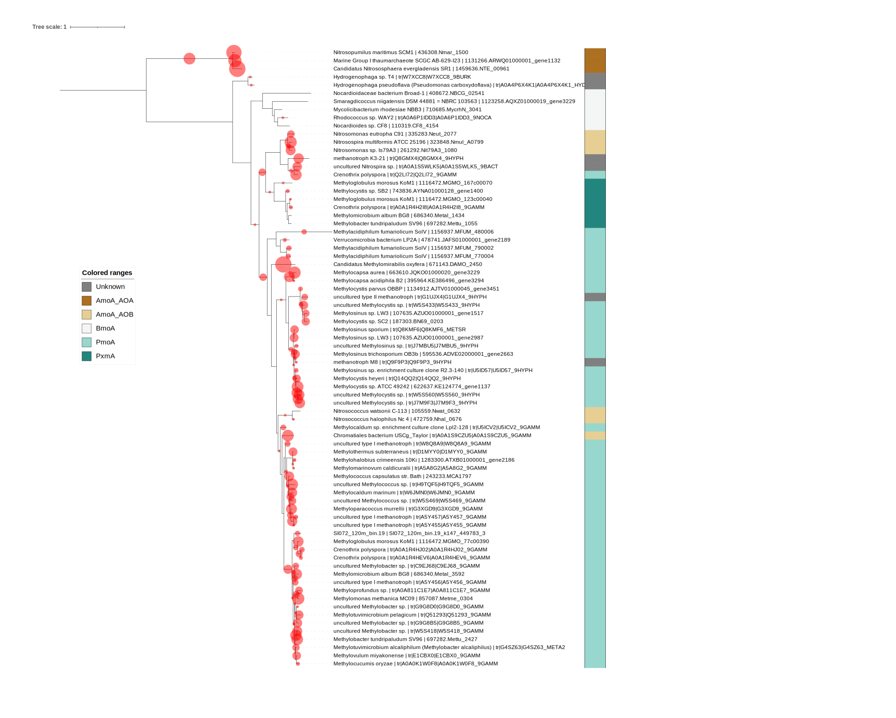

# Classifying unknown sequences with TreeSAPP and updating a reference package

## Introduction and goals

We will be updating the new particulate methane monooxygenase (pMMO) and ammonia monooxygenase (AMO) alpha subunit, or XmoA, reference package with XmoA amino acid sequences sourced from UniProt. You already created the reference package ([Creating a Reference Package For TreeSAPP]) and downloaded the sequences that will be used to update it ([Acquiring reference sequence data]).

There are four goals of this tutorial:

1) Learn how to classify query sequences using `treesapp assign`.
1) Learn how to update a TreeSAPP reference package with `treesapp update`.
1) Learn how to use `treesapp colour` to colour a phylogeny in iTOL.
1) Learn how to annotate features of phylogenetic clades using `treesapp layer`.

The first step involves using `treesapp assign` to classify the UniProt XmoA sequences. The second step is to use `treesapp update` to add the new sequences to the original XmoA reference package.

## Classify new sequences

Before we can begin using TreeSAPP, we must log onto the server and make sure we're in the same directory as all our data.

```{bash eval = FALSE}
cd /data/ts_tutorial/
```

According to `treesapp purity` in the [last chapter](#treesapp-create), and all other sanity checks, the XmoA reference package (contained in your working directory, `/data/ts_tutorial`, at `XmoA_seed/final_outputs/XmoA_build.pkl`) only contains XmoA sequences. At this point, you're able to use this reference package to classify sequences in any dataset using `treesapp assign`.

The command `treesapp assign` is perhaps the most popular command and is described in detail on the [TreeSAPP wiki](https://github.com/hallamlab/TreeSAPP/wiki/Classifying-sequences-with-treesapp-assign).


For these commands we will use the Block Mapping and Gathering with Entropy (BMGE) software to filter out regions of questionable homology from the alignment [@Criscuolo.2010]. Refer to the [BMGE publication](https://bmcecolevol.biomedcentral.com/articles/10.1186/1471-2148-10-210) for more information. To trim the multiple sequence alignments prior to phylogenetic placement use the `--trim_align` flag.
To use the PmoA and AmoA reference package we've built instead of any other reference packages that come with TreeSAPP we can use the argument `--refpkg_dir` with the path to a directory containing reference packages we want to use.

As usual, if you're unclear as to what any arguments are, you can use `treesapp assign -h` to get the complete usage and descriptions of each argument.

### Classifying amino acid sequences

We're first going to classify PmoA and AmoA sequences sourced from UniProt.
Before we classify them, the sequences all need to be combined in a single file using the `cat` shell command.

- Use `cat` to combine PmoA and AmoA sequences into the file `UniProt_XmoA.fasta`.
The output of `cat` is redirected from the console with the `>` symbol to a `<new file>`.


```{bash eval = FALSE}
cat UniProt_AmoA.fasta UniProt_PmoA.fasta > UniProt_XmoA.fasta
```

This new file will be the input to `treesapp assign`, provided with the `--fastx_input` argument.
In past TreeSAPP commands we specified the path to a single reference package with the `--refpkg_path` argument.
Since `treesapp assign` is capable of using multiple reference packages, the analogous argument is `--refpkg_dir`.
This should point to a directory containing one or more reference package .pkl files, all of which can be used for classifying the query sequences.
The output directory is `UniProt_XmoA_assign/`.

- Classify the 6966^[This is the number of sequences included in the files provided. Your files may be slightly different, and that's *probably* okay.] protein sequences in `UniProt_XmoA.fasta` using `treesapp assign`.

```{bash eval = FALSE}
treesapp assign \
  -n 4 \
  --trim_align \
  --refpkg_dir XmoA_seed/final_outputs/ \
  --fastx_input UniProt_XmoA.fasta \
  --output UniProt_XmoA_assign/
```

The command should take approximately twenty seconds to complete and if you see the line `TreeSAPP has finished successfully.` at the end then you're good to move on.

### Classifying ORFs predicted from genomes


The second batch of sequences that we will classify XmoA from are metagenome-assembled genomes (MAGs). MAGs are derived from assembled metagenome datasets (i.e. contigs or scaffolds) and represent the genome of a closely related microbial population. You can think of them as representing a single strain present in a microbial community.

We will need to download two files: the FASTA file containing the genomes and a table with the taxonomic label for each genome. These files, `SI072_MAGs.fa` and `SI072_MAGs_gtdbtk.bac120.summary.tsv`, are contained within a larger data package that we will be revisiting in the next tutorial.

-  Download the data package `SI072_sequence_data.tar.gz` from Zenodo and decompress it with `tar`.

```{bash eval=F}
wget https://zenodo.org/record/6323402/files/SI072_sequence_data.tar.gz && \
tar -xzvf SI072_sequence_data.tar.gz
```

The FASTA file was created by concatenating twelve different MAGs into a single file and prepending each sequence name (i.e. header) with the MAG name using the software [seqkit](https://bioinf.shenwei.me/seqkit/).
Concatenating multiple genomes into a single file saves time since you only need to run `treesapp assign` once instead of classifying each MAG individually.
Prepending the header with its respective MAG name is necessary to properly map the names of the query sequences back to their original genome names during the update process. Here is the shell command used (do not run):

```{bash eval = FALSE}
for f in *fa
do
  mag_name=$( basename $f | sed 's/.fa//g' )
  cat $f | seqkit replace -p "^" -r "${mag_name}_" >>SI072_MAGs.fa
done
```

The `treesapp assign` command we use is very similar from those we've used in the past.
We do not need to indicate which molecule type it is (i.e., nucleotides or amino acids) as TreeSAPP automatically determines this when reading the input.

```{bash eval = FALSE}
treesapp assign \
  -n 4 \
  --trim_align \
  --refpkg_dir XmoA_seed/final_outputs/ \
  --fastx_input SI072_sequence_data/SI072_MAGs.fa \
  --output SI072_MAGs_assign/
```

This command should take less than a minute to complete.
An extra step was required here for open reading frames (ORFs) to be predicted using the software [Prodigal](https://github.com/hyattpd/Prodigal).
The ORFs were translated to create protein sequences required by TreeSAPP for homology search, phylogenetic placement, etc.

## Update the reference package with new sequences

The initial XmoA_seed reference package was pretty small with just 36 sequences (information was retrieved using `treesapp package view num_seqs -r XmoA_seed/final_outputs/XmoA_build.pkl`). Also, there were only bacterial sequences included in this version and we know there are archaeal ammonia oxidizers too.
Let's see if we can expand on this seed reference package using the sequences from UniProt.

### Updating with publicly available sequences

You have already seen many of these flags and arguments before, and they're used again here just to remind TreeSAPP that we want results fast.
A couple of new ones are used, though. `treesapp update` won't take just any old FASTA file but relies on the outputs produced by `treesapp assign`.
So we'll guide it to the relevant output directory with `--treesapp_output UniProt_XmoA_assign/`.
From there, it will figure out what sequences were classified and what their assigned lineages were.

By default TreeSAPP will use the lineage that was assigned to each classified query sequence from the `treesapp assign` outputs.
Although these sequences are from UniProt (and originally GenBank) they do not have NCBI accessions or taxonomy IDs in the header, so we must provide taxonomic lineages for each sequence in a table.
Fortunately, we already have this information in the files `UniProt_AmoA.tab` and `UniProt_PmoA.tab`.

- Create a table mapping sequence names to taxonomic lineage information for `treesapp update`.
The first command creates a new file (`UniProt_XmoA.tsv`) with the table column names.
The second command pipes all rows in the UniProt lineage tables except the header line by using the `tail` command.
The `-q` parameter prevents `tail` from including the file name in the output.
The UniProt table rows are appended to the new file by using `>>` instead of one `>`.

```{bash eval = FALSE}
echo -e "SeqID\tOrganism\tDomain\tPhylum\tClass\tOrder\tFamily\tGenus\tSpecies" >UniProt_XmoA.tsv
tail -q -n +2 UniProt_*tab >>UniProt_XmoA.tsv
```

Alternatively, inverse pattern matching the word "Entry" --- the first column name in the exported UniProt tables --- with `grep --no-filename -v Entry UniProt_*tab` could have also worked.

To make TreeSAPP use this new table instead of using the taxonomic classifications generated by `treesapp assign` we use the `--skip_assign` flag.\
Finally, we are going to require that taxonomic lineages are resolved to at least the rank of *Order* with the argument `--min_taxonomic_rank`.
Resolving lineages of sequences to at least this rank will help us link them to their respective CuMMO groups more precisely.
This level of resolution isn't necessary for all reference packages but given the metabolic diversity within the CuMMOs of *Proteobacteria* alone, it is here.

- Update the reference package `XmoA_seed/final_outputs/XmoA_build.pkl` with classified UniProt XmoA sequences.
Use the argument `--seqs2lineage` to specify the path to the table containing taxonomic lineages for all UniProt XmoA sequences.

```{bash eval = FALSE}
treesapp update \
  --fast \
  --headless \
  --overwrite \
  --delete \
  --cluster \
  --trim_align \
  --min_taxonomic_rank o \
  -n 4 \
  --output XmoA_UniProt_update/ \
  --skip_assign \
  --treesapp_output UniProt_XmoA_assign/ \
  --refpkg_path XmoA_seed/final_outputs/XmoA_build.pkl \
  --seqs2lineage UniProt_XmoA.tsv
```

It looks like 39 new sequences were introduced into the reference package, bringing the total to 75 sequences.
And judging from the taxonomic rank summary printed during runtime both Archaea and Bacteria are now included:

```
Number of unique lineages:
	root       1
	domain     2
	phylum     6
	class      7
	order     10
	family    14
	genus     29
	species   46
```

### Updating with MAG sequences

We are now going to update the reference package that we just updated using the MAG sequences to demonstrate how to iteratively update reference packages.
Like the previous update, we must provide the taxonomic labels for each MAG.
The MAGs were assigned taxonomic labels using the [Genome Taxonomy Database](https://gtdb.ecogenomic.org/) toolkit (GTDB-tk)[@Chaumeil.2019].

We first need to reformat the table containing the taxonomic labels of the MAGs. We will employ the shell functions `awk` and `sed` to pull out the two columns we need and find-and-replace words and characters.

```{bash, eval = FALSE}
awk -F"\t" '{ OFS="\t"; print $1,$2 }' SI072_sequence_data/SI072_MAGs_gtdbtk.bac120.summary.tsv | \
sed 's/user_genome/Organism/g' | \
sed 's/classification/Lineage/g' | \
sed 's/;/; /g' >gtdb_classifications.tsv
```

Now that we have everything we need we can proceed to run `treesapp update` to add the MAG sequences to the reference package.

```{bash eval = FALSE}
treesapp update \
  --fast \
  --headless \
  --overwrite \
  --delete \
  --cluster \
  --trim_align \
  -n 4 \
  --output XmoA_MAG_update/ \
  --skip_assign \
  --seqs2lineage gtdb_classifications.tsv \
  --treesapp_output SI072_MAGs_assign/ \
  --refpkg_path XmoA_UniProt_update/final_outputs/XmoA_build.pkl
```

One of the XmoA sequences from the MAGs should have been added to the reference package bringing the total to 144 reference sequences.

A summary of the reference package will have been printed to the screen if `treesapp update` completed properly, and it should look like this:

```
Summary of the updated reference package:
ReferencePackage instance of XmoA (N0102):
	Molecule type:                                      'prot'
	TreeSAPP version:                                   '0.11.3'
	Profile HMM length:                                 '246'
	Substitution model used for phylogenetic inference: 'LG+G4'
	Number of reference sequences (leaf nodes):          144
	Software used to infer phylogeny:                   'FastTree'
	Date of last update:                                '2022-03-01'
	Description:                                        'Alpha subunits of copper membrane monooxygenase enzymes'
```

For supplementary reading on how to integrate sequences from SAGs and MAGs into reference packages please visit the [TreeSAPP Wiki](https://github.com/hallamlab/TreeSAPP/wiki/Integrating-MAGs-and-SAGs-in-reference-packages).

## Annotate clades

Protein families vary in their evolutionary complexity; many, especially genes involved in scavenging and metabolizing nutrients, have often been involved in some gene duplication and/or lateral gene transfer event. Moreover, closely related enzymes can vary in their activities and it is often valuable, though not necessary, to annotate such features. As previously discussed, XmoA includes PmoA and AmoA, which are involved in oxidizing methane and ammonia, respectively. Still other activities are mediated by members of this metabolically diverse protein family, including ethylene, propane and butane oxidation [@Khadka.2018]. Here, we will annotate reference sequences in the XmoA reference package so TreeSAPP can classify sequences more precisely and create colour-annotation files for iTOL.

Creating your own annotations involves scouring the literature to identify the phenotypes associated with each organism or taxon. For example, you would need to determine what paralogs or substrates are used by each organism in the reference package. Often though, these phenotypes are conserved across larger taxonomic groups, such as whole genera, families, orders, etc. 
If you are not familiar with the evolution of a protein family it may be helpful to find reference sequences for the activity, function, or other feature you're interested in and place them on the tree with `treesapp assign`. Then, guided by these sequences, it should be easier to annotate the clades.
Seeing as a literature review can't be accomplished within the time span of this tutorial, you can use the annotations already created for the XmoA reference package with extensive support from the literature [@Hallam2006; @Suzuki2012; @Oswald2017; @Khadka.2018; @Rochman2020].

```{bash eval = FALSE}
wget https://raw.githubusercontent.com/hallamlab/RefPkgs/master/Nitrogen_metabolism/Nitrification/XmoA/XmoA_taxonomy-phenotype_map.tsv
```

You can view the contents of this file with the Unix command `less`:

```{bash eval = FALSE}
less XmoA_taxonomy-phenotype_map.tsv
```

```
d__Archaea      AmoA_AOA
p__Verrucomicrobia      PmoA
p__Actinobacteria       BmoA
o__Chromatiales AmoA_AOB
f__Methylococcaceae     PmoA
f__Nitrosomonadaceae    AmoA_AOB
g__Haliea       EmoA
g__Methylocystis        PmoA
g__Methylosinus PmoA
g__Methylohalobius      PmoA
g__Methylocapsa PmoA
g__Methylothermus       PmoA
g__Methylomarinovum     PmoA
g__Hydrogenophaga       Unknown
s__Crenothrix polyspora PmoA
Candidatus Methylomirabilis oxyfera     PmoA
1116472.MGMO_167c00070  PxmA 
743836.AYNA01000128_gene1400    PxmA
1116472.MGMO_123c00040  PxmA
697282.Mettu_1055       PxmA
686340.Metal_1434       PxmA
ACE95886        PxmA
ACE95893        PxmA
ACE95890        PxmA
AEF15859        PxmA
tr|A0A1R4H2I8|A0A1R4H2I8_9GAMM  PxmA
```

To create annotate the XmoA reference sequences as these more resolved orthologous groups we will use `treesapp package`.
The specific reference package attribute that is modified is "feature_annotations".
The `treesapp package edit` subcommand only allows for a single attribute to be specified.
If the "feature_annotations" attribute is being edited the next command-line parameter indicates the name of the feature-annotation to edit.

- Add a new reference package feature annotation called CuMMO that will store the type of CuMMO for each reference XmoA sequence.
Include `--overwrite` to write the updated reference package to the same file.
<!-- file compatible with iTOL you will need to convert the taxonomy-phenotype mapping file with `treesapp colour`.  -->

```{bash eval = FALSE}
treesapp package edit \
  feature_annotations CuMMO \
  -r XmoA_MAG_update/final_outputs/XmoA_build.pkl \
  --taxa_map XmoA_taxonomy-phenotype_map.tsv \
  --overwrite
```

### Annotate features

With the CuMMO feature annotation included in the reference package, we can re-classify the PmoA and AmoA sequences from UniProt onto the MAG-updated reference package with `treesapp assign`.


```{bash eval = FALSE}
treesapp assign \
  -n 4 \
  --trim_align \
  --refpkg_dir XmoA_MAG_update/final_outputs/ \
  --fastx_input UniProt_XmoA.fasta \
  --output UniProt_XmoA_update_assign/
```

With the clade colours file in the tutorial directory, it is now simple to assign each of the classified query sequences to its respective functional guild with `treesapp layer`.

```{bash eval = FALSE}
treesapp layer \
  --refpkg_dir XmoA_MAG_update/final_outputs/ \
  --treesapp_output UniProt_XmoA_update_assign/
```

The output of this command is `UniProt_XmoA_update_assign/final_outputs/layered_classifications.tsv`.
It contains an extra column for the functional annotations but is otherwise identical to the original `classifications.tsv` file.
You can view the first 10 lines by using the Unix command `head`:

```{bash eval = FALSE}
head UniProt_XmoA_update_assign/final_outputs/layered_classifications.tsv
```

### Colouring phylogenies in iTOL

TreeSAPP can also create iTOL-compatible annotation files for colouring the phylogeny.

```{bash eval = FALSE}
treesapp colour \
  --output_dir XmoA_MAG_update/final_outputs/ \
  --refpkg_path XmoA_MAG_update/final_outputs/XmoA_build.pkl \
  --attribute CuMMO \
  --unknown_colour grey
```

The two output files ---`XmoA_CuMMO_colours_style.txt` and `XmoA_CuMMO_colour_strip.txt`--- can be used to bring colour to the JPlace file in iTOL.
The default colour palette used is "BrBG" from [colorbrewer.org](https://colorbrewer2.org/) but this can be changed by the `--palette` argument to any other colorbrewer palette.

Let's copy these two files into the `UniProt_XmoA_update_assign/iTOL_output` directory and transfer them to `<path to ts_tutorial_local>` on your (local) computer.

```{bash eval = FALSE}
cp XmoA_MAG_update/final_outputs/XmoA_CuMMO_*.txt UniProt_XmoA_update_assign/iTOL_output/
```
    
 -  **On your computer:** Transfer `UniProt_XmoA_update_assign/iTOL_output/` from the server to your local directory `ts_tutorial_local`.

```{bash eval = FALSE}
scp -r root@<server address>:/data/ts_tutorial/UniProt_XmoA_update_assign/iTOL_output <path to ts_tutorial_local>
```

-   Navigate to <https://itol.embl.de/> using a web browser and sign in using the group's username and password.

-   Upload the file `XmoA_complete_profile.jplace`. You can do this using either your computer's file browser then navigating to the `iTOL_output` directory and clicking-and-dragging the file, or iTOL's file uploader---the "Upload tree files" button. 

-   Next, navigate to the page displaying the phylogeny and click-and-drag the file `XmoA_labels.txt` from your file browser into the iTOL window. This should convert the TreeSAPP identifiers (e.g. 1_XmoA) to more useful descriptions with the organism name and accession for each leaf node.

-   The two files `XmoA_CuMMO_colours_style.txt` and `XmoA_CuMMO_colour_strip.txt` can be dragged into the iTOL browser window to bring colour to the XmoA tree.

-   Finally, turn on the "Phylogenetic Placements" dataset (right of the screen). The figure should look identical to Figure \@ref(fig:XmoA-Classified)

{width=100%} 