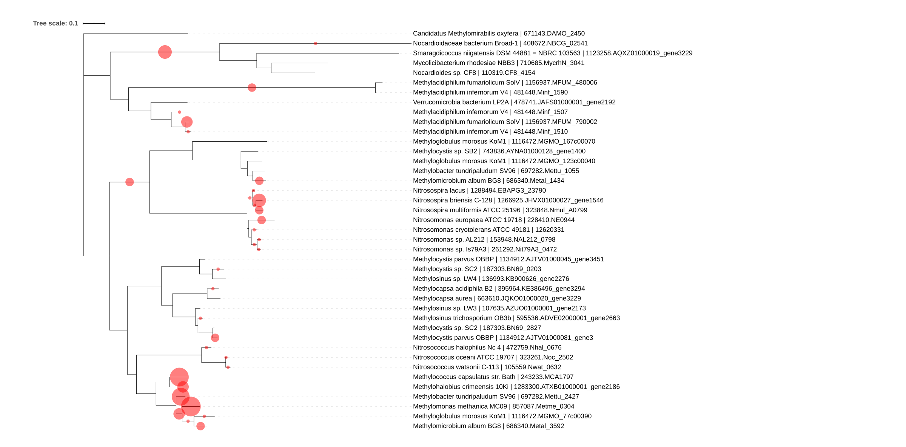

# Classifying unknown sequences with TreeSAPP and updating a reference package

Add introduction and goal

## Classify new sequences

At this point you're able to use this reference package to classify sequences in any dataset. For this tutorial though, we're going to classify PmoA and AmoA sequences sourced from FunGene. The sequences are from genomes of isolates and, because of FunGene's quality annotation pipeline, can likely be trusted.

The command `treesapp assign` is perhaps the most popular command and is described in detail [elsewhere](https://github.com/hallamlab/TreeSAPP/wiki/Classifying-sequences-with-treesapp-assign).\
For this command, we will use BMGE to trim the multiple sequence alignments prior to phylogenetic placement with the `--trim_align` flag. To use the PmoA and AmoA reference package we've built instead of any other reference packages that come with TreeSAPP we can use the argument `--refpkg_dir` with the path to a directory containing reference packages we want to use.

```{bash eval = FALSE}
treesapp assign \
  -n 4 \
  -m prot \
  --trim_align \
  --refpkg_dir XmoA_seed/final_outputs/ \
  --fastx_input p_amoA_FunGene9.5_isolates_C65S300_uclust99.faa \
  --output p_amoA_FunGene9.5_isolates_assign/
```

The command should take a few seconds to run and if you see a `TreeSAPP has finished successfully.` then you're good to move on.

## Analyze the classifications

### iTOL

First off, we can quickly and easily view where the sequences were placed on the phylogeny using the interactive Tree of Life (iTOL) [@Letunic.2019]. Navigate to <https://itol.embl.de/> using a web browser. Open the directory `p_amoA_FunGene9.5_isolates_assign/iTOL_output/XmoA/` and upload the file XmoA_complete_profile.jplace. This JPlace file contains both the phylogeny and the location of the placements that will be visualized.\
Next, navigate to the page displaying the phylogeny and click-and-drag the file `XmoA_labels.txt` into the iTOL window. This should convert the TreeSAPP identifiers (e.g. 1_XmoA) to more useful descriptions with the organism name and accession for each leaf node.

Finally, turn on the "Phylogenetic Placements" dataset (right of the screen) and the figure should look identical to this figure on the right.



The XmoA phylogeny with FunGene sequences placed onto it. The red bubbles represent sequence placements with the size of the bubble indicating the number of placements on a branch. There were 74 sequences classified, 34 of which were placed on the clade representing members of the *Gammaproteobacteria* order *Methylococcales*. Another 15 sequences were placed on the clade of *Betaproteobacteria*, represented by the genera *Nitrosospira* and *Nitrosomonas*.

### Classification table

The classification table contains detailed information corresponding to each classified query sequence. It is a tab-delimited table that can be read by a variety of tools. I tend to analyze most data in R and so the classification table was designed to be compatible with the tidyverse's extensive toolset. Likewise, it should be similarly easy to use Python to analyze these data with its rich suite of visualization libraries, e.g., `plotly` and `matplotlib`.

Here are the first few lines from `p_amoA_FunGene9.5_isolates_assign/final_outputs/marker_contig_map.tsv`:

```
Sample	Query	Marker	Start_pos	End_pos	Taxonomy	Abundance	iNode	E-value	LWR	EvoDist	Distances
p_amoA_FunGene9.5_isolates_C65S300_uclust99	AAL86638  coded_by=1..825,organism=Nitrosomonas sp. JL21,definition=ammonia monooxygenase subunit A	XmoA	4	251	r__Root; d__Bacteria; p__Proteobacteria; c__Betaproteobacteria; o__Nitrosomonadales; f__Nitrosomonadaceae; g__Nitrosomonas; s__Nitrosomonas sp. Is79A3	1.0	13	1.4e-114	0.9234534156	0.0404	0.0227,0.0177,0.0
p_amoA_FunGene9.5_isolates_C65S300_uclust99	AAG60667  coded_by=824..1645,organism=Nitrosomonas cryotolerans ATCC 49181,definition=ammonia monooxygenase subunit A	XmoA	4	251	r__Root; d__Bacteria; p__Proteobacteria; c__Betaproteobacteria; o__Nitrosomonadales; f__Nitrosomonadaceae	1.0	16	3.7e-114	1.0	0.1305	0.0128,0.0205,0.0972
p_amoA_FunGene9.5_isolates_C65S300_uclust99	BAH22839  coded_by=2160..2948,organism=Methylococcaceae bacterium ET-HIRO,definition=methane monooxygenase protein A2	XmoA	2	253	r__Root	1.0	61	7.1e-104	1.0	1.3677	0.083,0.5314,0.7534
```

A description of each of the fields can be found under the [`treesapp assign` documentation page](https://github.com/hallamlab/TreeSAPP/wiki/Classifying-sequences-with-treesapp-assign#classification-table).

Section on how to analyze table in R?

## Update the reference package with new sequences

The XmoA_seed reference package was pretty small with just 36 sequences (information was retrieved using `treesapp package view num_seqs -r XmoA_seed/final_outputs/XmoA_build.pkl`). Also, there were only bacterial sequences included in this version and we know there are archaeal ammonia oxidizers too! Let's see if we can expand on this seed reference package using the sequences from FunGene.

You have already seen many of these flags and arguments before and they're used again here just to remind TreeSAPP that we want results fast. A couple of new ones are used though.\
`treesapp update` relies on the outputs produced by `treesapp assign`, it won't take just any old FASTA file. So we'll guide it to the relevant output directory with `--treesapp_output p_amoA_FunGene9.5_isolates_assign/`. From there it will figure out what sequences were classified and what their assigned lineages were.\
By default TreeSAPP will use the lineage that was assigned to each classified query sequence from the `treesapp assign` outputs. Since these sequences are from FunGene (and originally GenBank) they have NCBI accessions, meaning we can use that information to download their true taxonomic lineages. To activate that we use the `--skip_assign` flag.\
Lastly, we must give it the path to the reference package to update with `--refpkg_path XmoA_seed/final_outputs/XmoA_build.pkl`.

```{bash eval = FALSE}
treesapp update \
  --fast \
  --headless \
  --overwrite \
  --delete \
  --cluster \
  --trim_align \
  -n 4 \
  -m prot \
  --fastx_input XmoA_seed.faa \
  --output XmoA_FunGene_update/ \
  --skip_assign \
  --treesapp_output p_amoA_FunGene9.5_isolates_assign/ \
  --refpkg_path XmoA_seed/final_outputs/XmoA_build.pkl
```

Alright, it looks like 27 new sequences were introduced to the reference package, bringing the total to 63 sequences! And judging from the taxonomic rank summary printed during runtime both Archaea and Bacteria are now included.

## Tree topology after update


