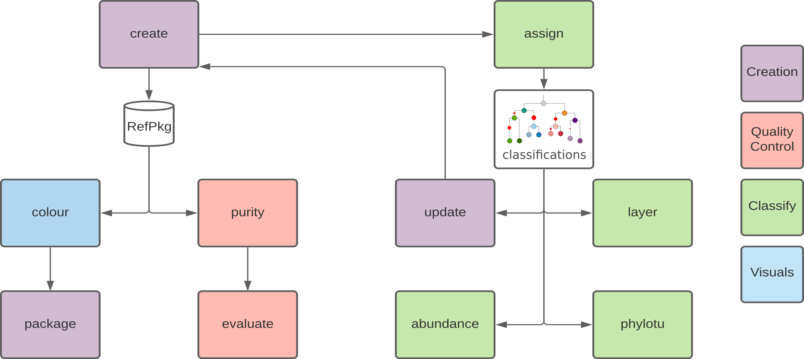

# A tutorial for using TreeSAPP

## Introduction and goals

In this series of tutorials, students will analyze a gene family by creating a TreeSAPP reference package (refpkg). Students will work through a typical workflow of TreeSAPP both with an example gene (XmoA) to familiarize yourself with the tools, and then you will repeat the steps with a gene assigned to your group for which no reference package exists. You will document your efforts for the new reference package in Problem Set 5.

## TreeSAPP workflow

TreeSAPP is a Python package for gene-centric analysis. It uses custom protein sequence databases called reference packages (RefPkg)

{width=100%}

-   [Acquiring reference sequence data].
-   [Creating a Reference Package For TreeSAPP].
-   [Classifying unknown sequences with TreeSAPP and updating a reference package].
-   [Calculating relative abundance of meta'omic data].
-   [Analysing the TreeSAPP classifications in R].

## Genes for creating reference packages

Reference packages can be built for nearly any protein-encoding gene but to demonstrate the process of gene-centric analysis we will create and use a reference package for XmoA.

### XmoA

The protein family we will be focusing on is that of the copper-containing membrane-bound monooxygenases @Khadka.2018. This family contains particulate methane monooxygenase (pMMO) and ammonia monooxygenase (AMO) and well be building a reference package for the alpha subunits of these enzymes called XmoA. All students will work through this example individually.

## Tools

### Shell

Please use this short [Shell cheat sheet] for commonly used commands and review previous tutorials on Canvas. 

### TreeSAPP

Tree-based Sensitive and Accurate Phylogenetic Profiler (TreeSAPP) @Morgan-Lang.2020 can be found on [GitHub](https://github.com/hallamlab/TreeSAPP) including an excellent [wiki](https://github.com/hallamlab/TreeSAPP/wiki) with additional information on each of the `treesapp` subcommands.

### iTOL

Interactive Tree Of Life ([iTOL](https://itol.embl.de/)) @Letunic.2019 is a browser-based tool that allows you to visualize data generated in TreeSAPP as a phylogenetic tree with additional annotations.

## Data

Other than [The Saanich Inlet data set] already located on the server, you may download data from different databases:

-   [FunGene](http://fungene.cme.msu.edu/), the functional gene pipeline and repository
-   [EggNOG](http://eggnog5.embl.de/#/app/home), evolutionary genealogy of genes: Non-supervised Orthologous Groups
